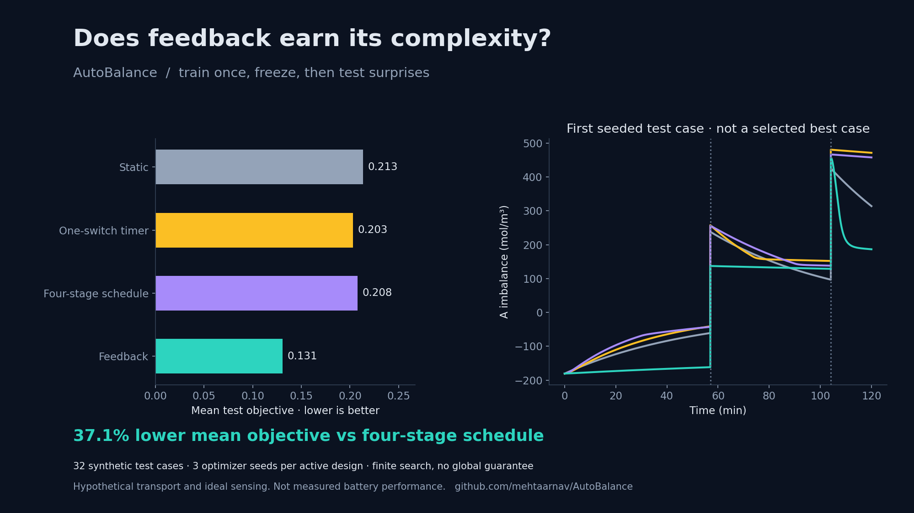

# AutoBalance

An open research lab asking **when a responsive membrane earns its complexity**.

AutoBalance tests concentration-driven membrane control against optimized fixed transport, a one-switch timer, and a four-stage schedule. Train on declared disturbances, freeze every policy, then evaluate events they were not tuned on. Publish the failures alongside the wins.

This is a computational control hypothesis. It is not a demonstrated battery, a new membrane material, or a measured efficiency improvement.



The recorded feedback design reduced the mean objective by **38.8% versus static**, **35.7% versus a one-switch timer**, and **37.1% versus a four-stage schedule** across 32 unseen synthetic scenarios. It won each individual composite-score comparison in this finite test set. This is evidence for the stated benchmark, not a guarantee across disturbances or an improvement in battery efficiency. All active searches exhausted their fixed budgets; no global-optimality claim is made.

## Run the lab

```sh
python -m pip install -e ".[test]"
python -m pytest -q
python -m streamlit run app/dashboard.py
```

The dashboard opens the recorded benchmark. Explore any of its 32 unseen scenarios, introduce your own disturbance, inspect all scores, and download the provenance manifest. The original single-disturbance experiment remains in the sidebar.

To regenerate the research result:

```sh
python experiments/benchmark.py
```

Python 3.10+; CPU only. The multi-seed search takes several minutes. `requirements-reproduce.txt` records the direct dependency versions used for the checked-in result. It is a reproducibility aid, not a complete platform lock.

## The experiment

Two well-mixed reservoirs exchange a useful species A and an undesired species B. Both are conserved. The membrane senses an ideal log-concentration voltage proxy and changes its permeance with a finite response time.

Four designs share the transport bounds:

| Design | Information available | Tuned parameters |
| --- | --- | --- |
| Best static | None | Constant permeance |
| One-switch timer | Clock | Low/high permeance and switch time |
| Four-stage schedule | Clock | Four target permeances in equal time bins |
| Feedback | Present concentration signal | Low/high permeance, threshold, sensitivity |

Every active design starts at the same minimum permeance, has the same 100-second actuator response, and uses the same physical gate-motion coordinate. A static material starts at its chosen fixed permeance and pays no actuation cost.

The optimizer fits four public training scenarios. Three predetermined seeds are used for each active design, and only training score selects the winner. Thirty-two separately generated test scenarios contain two surprise disturbances each. Additional tests change area and reservoir volume without retuning. These are synthetic stress tests, not representative battery operating data.

The objective combines integrated squared imbalance, B transfer, and a gate-motion penalty. Its components are reported separately. It is integrated alongside the physical equations, so output sampling cannot change optimization scores. The motion term is a proxy, not measured energy.

The complete record is in [the manifest](results/benchmark/manifest.json), [every score](results/benchmark/scores.csv), and [the build log](docs/BUILD_LOG.md). Finite optimizer budgets do not certify global optima. Neither time-based comparator represents every possible open-loop policy.

## The limit that makes this interesting

With the assumed law `P_B = 0.08 P_A`, every controller has the same unwanted transfer at the same final A recovery, between disturbances. Timing cannot create selectivity. The original 40.1% nominal objective improvement therefore did not, by itself, establish a benefit from feedback.

That observation changed the experiment: compare against clocks, then test surprises. Read the [scientific case](docs/scientific_case.md) for the proof, prior art, and explicit ways the hypothesis could fail.

Likewise, positive permeance makes undisturbed imbalance decrease monotonically. This passive model cannot generate an unstable or oscillatory recovery region. The original map distinguishes fast and slow recovery, not a stability transition.

## What is established, and what is missing

The software verifies conservation, analytical transport solutions, exact event jumps, finite gate response, consistent actuator costs, sign symmetry, and output-independent objectives. The benchmark saves source hashes, dependency versions, policy parameters, random seeds, training cases, test cases, and optimizer status.

The transport parameters are hypothetical. Real redox chemistry, electroneutrality, water transfer, sensor noise, gate energy, hysteresis, cycling, and aging are absent. The voltage signal is a concentration-cell proxy, not validated battery state estimation. Feasibility remains unverified.

The next evidence step is independent measurement of species-specific permeance versus gate state, followed by signal calibration and an energy audit. The [experimental plan](docs/EXPERIMENT_PLAN.md) states what to measure and what would falsify the proposed mechanism. The [literature ledger](data/literature_evidence.csv) separates related experimental results from unsupported transfer to this model.

## Build in public

- [Research decisions and failed assumptions](docs/BUILD_LOG.md)
- [Launch draft](docs/LAUNCH_DRAFT.md)
- [One-minute demo script](docs/DEMO_SCRIPT.md)
- [Original nominal experiment](docs/NOMINAL_EXPERIMENT.md)
- [Contribution standards](CONTRIBUTING.md)

The code favors direct equations, small functions, and comments that explain physical reasoning. Tests and formatting checks run through GitHub Actions. MIT licensed; reproducible criticism is welcome.
